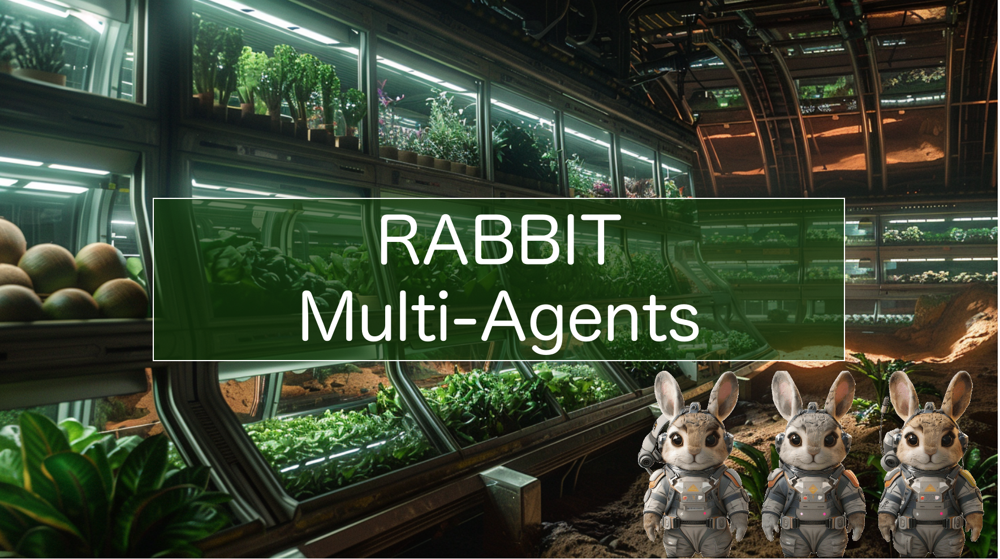

 

<a href="">
植物工厂自动运营
</a>
&nbsp;&nbsp;•&nbsp;&nbsp;
<a href="">
多智能体协同操作
</a>

* **主题**：帮助人类在星际穿越中找到适宜的生存地，并确保宇航员能持续获取新鲜食物。（ Cornfield Chase |星际穿越 ）
* **愿景**：利用植物工厂技术，在外太空飞船和未来殖民地城市中生产粮食，提供无污染、无农药的果蔬。
* **挑战**：植物工厂自动化程度高，但工程师仍需处理中低级任务，影响效率。

* **解决方案**：通过LLM驱动的Multi-Agent自动运营工作流，部署了三个 AI 代理：

    * AI 数据分析师：利用 qwen-max 模型分析历史数据，为 AI 助理农艺师提供分析结果。
    * AI 助理农艺师：结合 RAG 文档和 AI 数据分析师的结果，进行种植建议。使用 moonshot-v1-128k 模型处理长文本。
    * AI 执行工程师：与人类工程师合作，根据分析结果调整植物工厂设备参数。

* **学习的众多新工具和技术**：
    * LLM 大模型：包括 Moonshot 上下文长文本缓存和通义千问数理统计分析。
    * RAG 检索：原创的解决问题导向范围可控 RAG。
    * 前端与部署：使用 Zeabur 和 Gamma。
    * AIGC 设计：[采用 Midjourney，Light Year AI，Tripo AI 以及 HyperHuman](https://rcnct1jfor65.feishu.cn/docx/A8CMdlmMKoDEMbxKrXxcYkgBnIh?from=from_copylink)

*注：本项目repo在之前被建立初衷是为了入门llm，在Adventure X开幕当天正式作为团队项目repo*

# 引言

我们选择的主题是Cornfield Chase；人类拓展为多星系物种并在星际穿越中寻找合适的生存地。为此，我们需要为这一旅程做好准备。如何确保宇航员能够持续享用新鲜食物，是一个关键问题。

## 面向未来

在人类迈向多行星文明时代的过程中，我们需要在外太空飞船和未来殖民地城市中能够生产粮食。植物工厂作为农业的终极形态，能够实现这一目标。植物工厂致力于使人类不再依赖自然条件，而是在室内垂直地进行多层农作物种植，主要采用水培和雾培技术。此外，室内环境可以人为地精准调控光、温、水、气、肥等条件。因此，植物工厂有望成为未来城市的一部分，为市民提供就近、零污染、零农药、新鲜的果蔬。

## 问题导向

尽管植物工厂中的许多工作已经可以自动化，但专业工程师在日常工作中仍需处理许多中低级任务，例如分析每棵菜的长势。这是我们发现的一个“Paper Cuts”问题。我们希望通过使用大型语言模型（LLM）代理来解决这个问题，彻底解放工程师，让他们专注于创造性和判断性工作。我们的目标是重新定义植物工厂工程师的日常工作流程，使高级工程师能够同时管理和负责更大的种植面积，从而提升整个植物工厂的效率。这将使长途星际穿越成为可能。

# 解决方案

我们的多代理管理软件已经具备基础的数据可视化和设备控制面板。在此基础上，我们在整个工作流程中部署了三个 AI 代理，它们分别负责以下岗位：

1. **AI 数据分析师**：由 qwen-max 模型赋能，负责对历史数据进行分析，统计不同种植参数的情况。然后将分析结果传送给 AI 助理农艺师。

2. **AI 助理农艺师**：其职责是针对人类工程师提出的问题，缩小 RAG 文档的范围，从选定的知识文档中提炼知识，并结合 AI 数据分析师的分析结果，对下一步的种植进行浅层分析和建议。为了处理大量内容，这里采用了 moonshot-v1-128k 模型进行长文本缓存工作。

3. **AI 执行工程师**：负责与人类工程师紧密合作，首先根据前面的累积分析更新判断植物的最佳生长状况。当人类工程师批准方案后，执行植物工厂设备参数的调整和控制操作。

**扬长避短**：通过上述工作流程，我们解放了人类工程师的双手，使他们能够将精力集中在判断上。同时，利用专业的多代理种植管理工作流，发挥了 LLM 的长文本处理和总结能力，并利用定制规则和 Moonshot 上下文缓存能力的 RAG 技术来抑制 LLM 的幻觉现象。

# AdventureX期间项目启动所学新工具

**LLM大模型**

* Moonshot 上下文长文本缓存
* 通义千问数理统计分析

**RAG检索**

* 【原创】解决问题导向范围可控RAG

**前端&部署**

* Zeabur
* Gamma

**2D 设计**
- Midjourney
- Light Year AI
 
**3D 设计**
- Tripo AI
- HyperHuman
