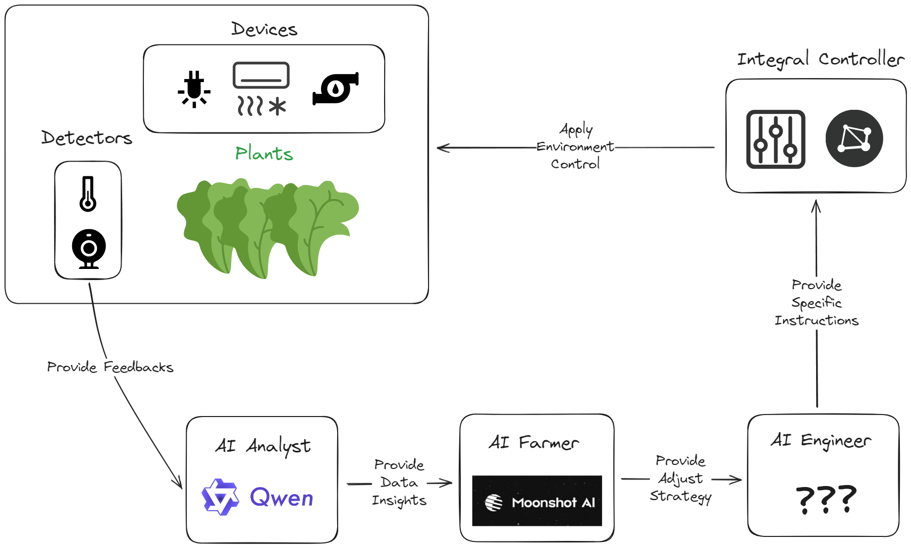

 

<a href="">
Automated Operation of Plant Factories
</a>
&nbsp;&nbsp;•&nbsp;&nbsp;
<a href="">
Multi-Agent Collaborative Operation
</a>

* **Vision**: Leveraging plant factory technology, we aim to ensure people are no longer dependent on weather for food, enabling year-round access to pollution-free, pesticide-free fruits and vegetables anywhere, including outer space.

* **Challenge**: Although plant factories can collect a lot of data based on IoT technology, the data analysis and processing still require significant involvement from engineers, with many tasks being highly repetitive.

* **Solution**: Through a Multi-Agent automated operation workflow driven by large language models (LLMs), we deploy three AI agents:

    * AI Data Analyst: Uses the qwen-max model to analyze historical data and provide results to the AI Assistant Agronomist.
    * AI Assistant Agronomist: Combines RAG documents and the AI Data Analyst’s results to offer planting recommendations, using the moonshot-v1-128k model for long text processing.
    * AI Implementation Engineer: Collaborates with human engineers to adjust plant factory equipment parameters based on the analysis results.

# Technical Approach

This project aims to test the LLM's abilities in:
1. Processing and analyzing long texts and data: Assessing its mathematical understanding and tool usage.
2. Converting texts into actionable planting strategies: Evaluating how it extracts relevant professional documents from the knowledge base and provides scientific advice.
3. Translating strategies into actual device control parameters: Determining if the LLM can generate specific values to control the equipment based on planting strategies.

# Workflow Structure

The three testing points are represented by three interconnected AI Agents. We avoid using a single comprehensive Agent to ensure the LLM's text generation scope remains controllable, with each Agent handling a specific task.

1. **AI Data Analyst**: Analyzes historical data, summarizes the conditions of different planting parameters, and sends the analysis results to the AI Assistant Agronomist. Here, the qwen-max model is used to parse pandas dataframes.

2. **AI Assistant Agronomist**: Addresses issues that human engineers want to solve by narrowing the scope of RAG documents using labels, extracting knowledge from selected documents, and providing preliminary analysis and recommendations for the next planting step. To handle large amounts of content, the moonshot-v1-128k model is used for long text caching.

3. **AI Implementation Engineer**: Updates and determines the optimal growth conditions for plants based on cumulative analysis. Upon approval from human engineers, it executes the adjustment and control operations of the plant factory equipment parameters.

**Leveraging Strengths and Avoiding Weaknesses**: Through the above workflow, we free human engineers to focus on decision-making. By utilizing a professional multi-agent planting management workflow, we exploit the LLM's long text processing and summarizing capabilities, and use RAG technology with custom rules and Moonshot's context caching to mitigate LLM hallucinations.

# New Tools Learned During AdventureX Project Launch

**LLM Models**

* Moonshot long text context caching
* Tongyi Qianwen statistical analysis

**RAG Retrieval**

* [Original] Problem-Solving Oriented Controllable Scope RAG

**Frontend & Deployment**

* Zeabur
* Gamma

**2D Design**
- Midjourney
- Light Year AI
 
**3D Design**
- Tripo AI
- HyperHuman
